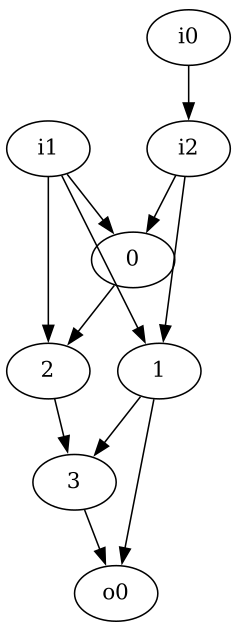
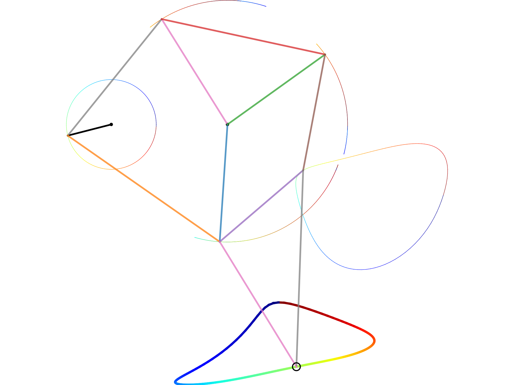
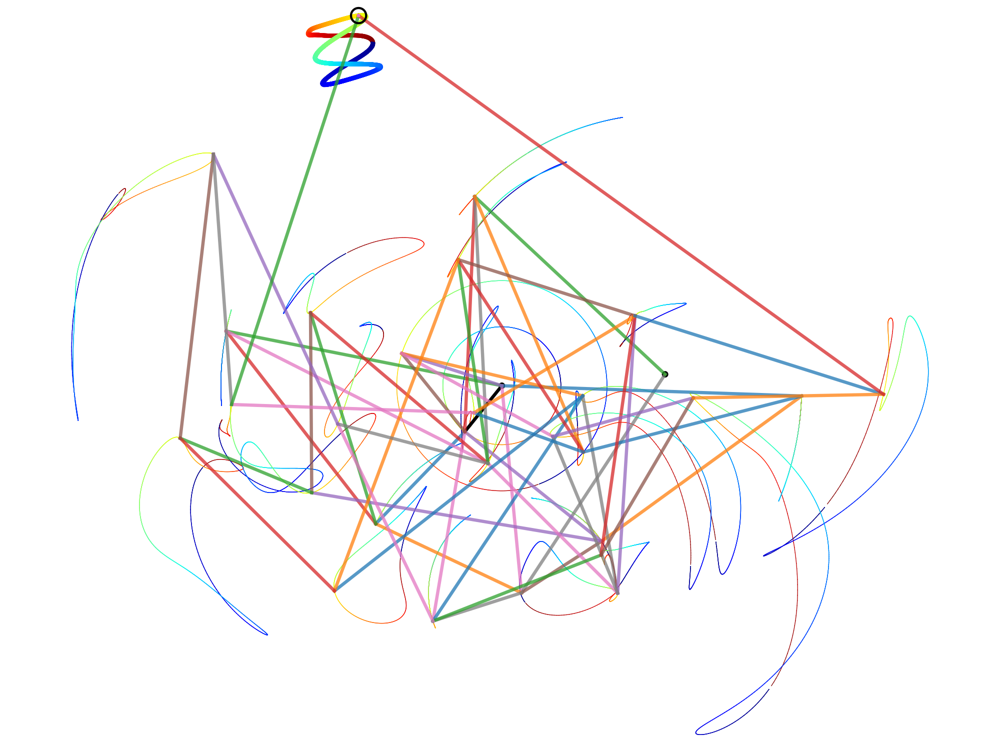
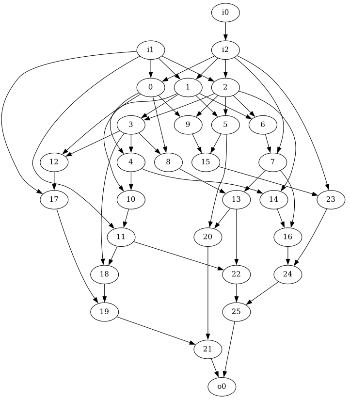
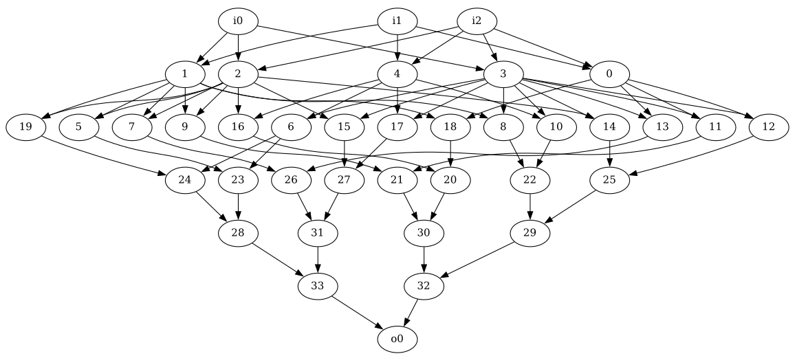
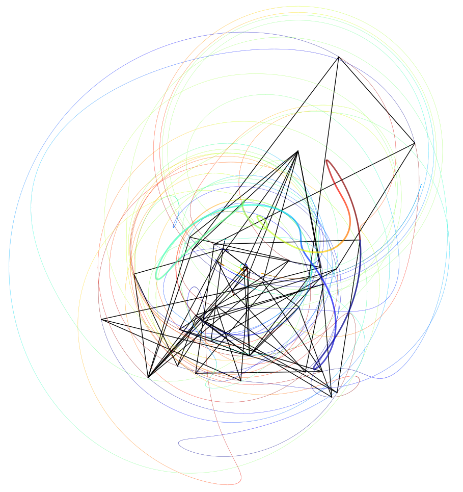
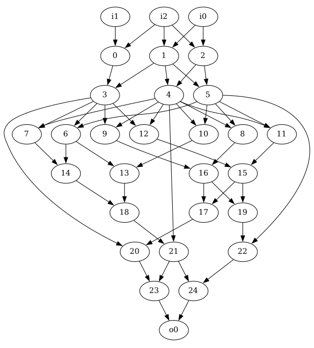
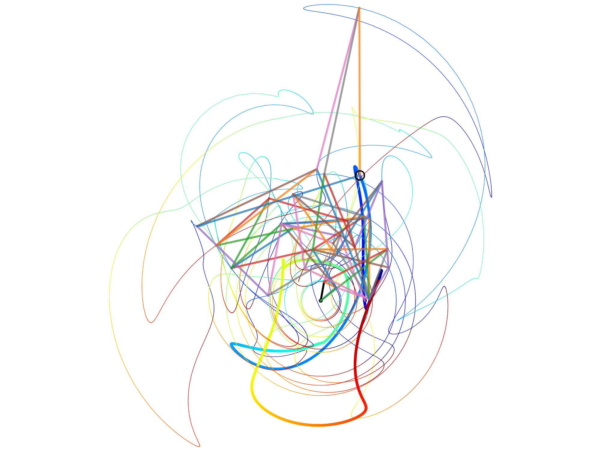

# RigNN: A Mechanical Linkage Neural Network
This is a set of Python functions that offers the ability to create 2D mechanical linkages consisting of struts and joints. The scripts allow one to treat the mechanical network of linkages between the struts as a fully non-linear neural net (with non-linear neurons), which can be optimized to perform different functions. For the fun of it, let's call this type of neural net, Rigid Neural Net, or RigNN.

## Motivation

This project was made for fun. The idea is to use a mechanical linkage as a mechanistic model of a highly non-linear neural net (RigNN). The parameters of the neural net are the lengths of the struts (or links) and/or the motion of the "input" joints. Those can be optimized for different applications. Note that because of the mechanical constraints, each neuron (strut) is non-linear, unlike the linear neurons used in standard neural nets. (Of course, for small strut movements, the kinematics equations for each joint in a mechanical linkage can be linearized. However, they remain non-linear in the general case.)

In the examples below we show different mechanical linkages that start with three nodes (or joints) and end with one joint. Two of the three "input" joints are fixed and the third describes circular motion around one of those fixed joints. The last node in each network can be thought of as being attached to a stylus that draws different closed curves. Thus, this type of linkage transforms uniform circular motion (of the third input node) to motion of the last node, which can be optimized to trace a particular closed curve. This type of network was motivated by the Strandbeest creation by Theo Jansen (see example below). 

One can envision modifications to the above scenario. One can use more than three input nodes, with different input nodes moving in different ways. One can use more than one output node, the position of which can be treated as the output of the neural net. The constraint of 2D motion can be lifted and the struts can be allowed to move in 3D or even in N-dimensional space, allowing for more back-connections per node, rather than the current 2 per node required by the mechanical constraints.

This code includes utilities for the design of networks of arbitrary number of inputs and outputs corresponding to mechanical linkages in 2D. The types of networks that can be created are: random, multi-layered, ResNet-type and others (see `Fgen3.py`). It also includes a function which uses PyTorch to create linkages with a last node that traces out a supplied closed curve (see `neuralbeast.py`), thus treating the linkage explicitly as a non-linear neural net. Those capabilites are illustrated below.

## Examples

### 1. Jansen's [Strandbeest](https://en.wikipedia.org/wiki/Jansen%27s_linkage)

The Strandbeest example can be run by issuing the commands below in Python. Here we do **not** optimize the linkages with pyTorch. Instead we are using the length parameters obtained by Theo Jansen.

	# First will show trajectories and once those that window is closed, 
	# it will create an mkv video of the motion.
	In [1]: from viz3 import StrandbeestOutput
	In [2]: StrandbeestOutput()

Below is the graph of connections for the Strandbeest mechanical linkage. The labels for the inputs start with `i` and the output label starts with `o`.

Below is a snapshot of the physical realization of the Strandbeest linkage with traces drawn by the motions of each node. The two fixed nodes are highlighted as dots. The one on the left is connected to the third input node which traces out a circle. The output node (circled) draws the shape at the bottom.

Below is a video of the corresponding motion of the joints in the linkage.

https://user-images.githubusercontent.com/6117115/224114162-71b9a748-5c1f-42cb-b7ba-ab20aecd5d9a.mp4

### 2. Mechanical linkage as a highly non-linear Neural Net. Using PyTorch to optimize a mechanical linkage to draw a Lissajous figure.

The linkage graph can be considered a non-linear net with parameters given by the linkage lengths. Here we use PyTorch to optimize those parameters such that the last node of the mechanical linkage draws a Lissajous figure.

Below is one realization of the graph of linkages of generated by the algorithm:

Below is a snapshot of the traces by each node in one particular realization of the net. The final node traces the thick Lissajous figure seen in the upper part of the figure.

Below is an animated version of the trajectories of the joints of the linkage:

https://user-images.githubusercontent.com/6117115/224113902-1710a84b-1364-4acb-9f61-bf842b5b3671.mp4

Below is video of how PyTorch converged to the final result. It shows the iterative improvement of the output curve (red) drawn by the last joint in the network of joints relative to the input curve (blue). 

https://user-images.githubusercontent.com/6117115/224111744-8ea7f7f9-0e14-4790-9d35-8327052b1e24.mp4

To create the network above, we issued the commands that follow. The function `RunNet()` below creates a random net of linkages with certain constraints (see the code). Then it uses PyTorch to optimize the lengths of the links until the last node draws a Lissajous figure. If the algorithm decides a particular graph of linkages is not efficiently converging, the code automatically restarts the optimization with a different random graph subject to constraints.

	In [1]: from neuralbeast import *
	In [2]: net,epoch,loss=RunNet()
	   ...: # First it will create and show the network corresponding to the strut linkage.
	   ...: # It will then show the iterative improvement of the output curve (red) drawn by the 
	   ...: # last joint in the network of joints relative to the input curve (blue).
	   ...: # The best network parameters are saved in output*.pt (* iterates between 0 
	   ...: # and 1 so that there is always one file that is definitely intact
	   ...:  even if you kill the process).
	   ...: # If process is killed by ctrl+C, the code will show the trajectory and exit.

### Random linkage network

Here are some examples which use the provided functions to create different linkage networks. The examples are not optimized for a particular purpose. They just illustrate random realization of the mechanical linkage neural net.

The example below is of a random linkage network starting with 3 input nodes and ending in 1 node, containing 30 nodes total. It avoids triangular link structures, has a shortest distance between input and output node of 4 links and largest distance of 10 links.

    In [1]: from Fgen3 import *
    In [2]: F=genF_Random(30,3,1,triangles=False,shortestDistance=4,
       ...: longestDistance=10,strictDistanceInequality=True)
    In [3]: showF(F,node0connection=True,lines=False) # Show network
    In [4]: from utilities import setupCoo
    In [5]: lds=setupCoo(F) # Create a random realization of the mechanical linkage
    In [6]: from viz3 import showTraj
    In [7]: showTraj(F,lds) # display actual linkage and traces of each vertex
    In [8]: from viz3 import animateTraj
    In [9]: animateTraj(F,lds,N=300,numDataPoints=300)

Below is the graph of one realization of the network:

Below are the traces obtained by the nodes of the mechanical linkage as node `i2` goes in a circle around `i0`.

### A layered linkage network

Below is a layered network, with the number of links specified in the list below. Intermediate layers are created as needed to satisfy the mechanical constraint of having only two backwards connections to each link. 

    In [1]: from Fgen3 import *
    In [2]: F=genF_ManyLayers([3,5,15,1]) # Creates a graph connection matrix. See Fgen3.py
    In [3]: showF(F,node0connection=False,lines=False) # Show network
    In [4]: from utilities import setupCoo
    In [5]: lds=setupCoo(F) # Create a random realization of the mechanical linkage
    In [6]: from viz3 import showTraj
    In [7]: showTraj(F,lds) # display actual linkage and traces of each vertex
    In [8]: from viz3 import animateTraj
    In [9]: animateTraj(F,lds,N=300,numDataPoints=300)

Below is the graph of one realization of the network. To see the layered structure better, the 0th and 2nd node are not explicitly connected in the graph (as they are in the Strandbeest example).

Below one can see the traces obtained by the nodes of the mechanical linkage as node `i2` goes in a circle around `i0`.

### A ResNet type network

This network is mimicking the types of connections one encounters in Residual Networks. The main layers have number of nodes as follows: 3->3->3->3->2->1. And to those layers we attach a network that starts at the second layer above and ends at the forth layer with number of nodes as follows: (2nd layer in main network)->7->4->3->(4th layer in main network).

    In [1]: from Fgen3 import *
    In [2]: F=genF_Stack( 
       ...: genF_ResNetConnect(genF_ManyLayers([3,3,3]),genF_ManyLayers([3,7,3])),
       ...: genF_ManyLayers([3,1]))
    In [3]: showF(F,node0connection=False,lines=False) # Show network
    In [4]: from utilities import setupCoo
    In [5]: lds=setupCoo(F) # Create a random realization of the mechanical linkage
    In [6]: from viz3 import showTraj
    In [7]: showTraj(F,lds) # display actual linkage and traces of each vertex
    In [8]: from viz3 import animateTraj
    In [9]: animateTraj(F,lds,N=300,numDataPoints=300)

Below is the graph of one realization of the network:

Below one can see the traces obtained by the nodes of the mechanical linkage as node `i2` goes in a circle around `i0`.

## License

**Author:** Svetlin Tassev (2022-2023)

**License:** GNU General Public License v3.0
